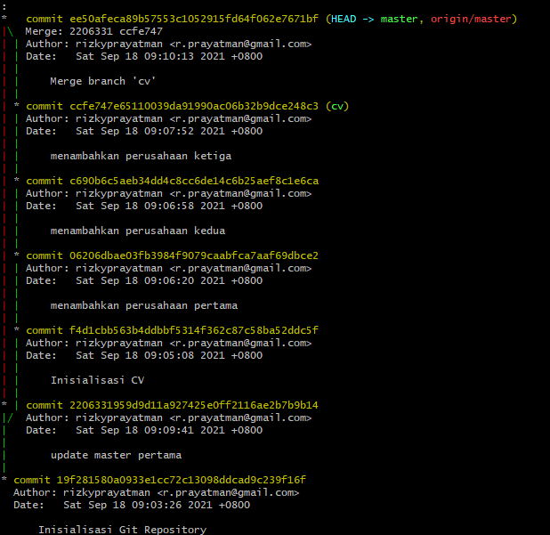

# 02 Git Branch

Link Repository : https://github.com/rizkyprayatman/git-branch

Berikut langkah yang dilakukan

1. mkdir rizkyprayatman  
   cd rizkyprayatman
2. touch README.md  
   nano README.md
3. git init  
   git add README.md  
   git commit -m "Inisialisasi Git Repository"  
4. git branch "cv"  
5. git checkout cv  
   touch cv.txt  
   nano cv.txt  
   git add .  
6. git commit -m "Inisialisasi CV"  
7. nano cv.txt  
   git add .  
   git commit -m "add perusahaan  
   pertama"  
   nano cv.txt  
   git add .  
   git commit -m "add perusahaan  
   kedua"  
   nano cv.txt  
   git add .  
   git commit -m "add perusahaan  
   ketiga"  
8. git checkout master  
9. nano README.md  
   git add .  
   git commit -m "add perusahaan pertama"  
10. git merge cv  
11. git remote add origin https://github.com/rizkyprayatman/git-branch.git
     
    git push -u origin master  

## Screenshoot Terminal

 

