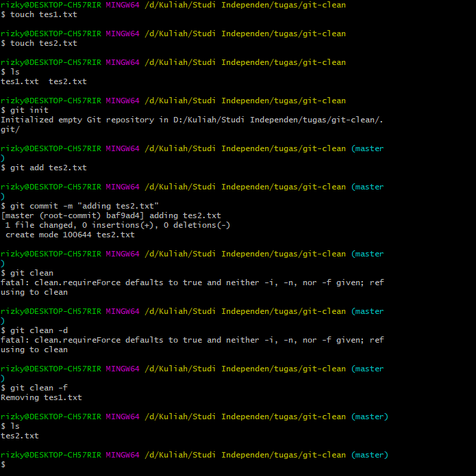
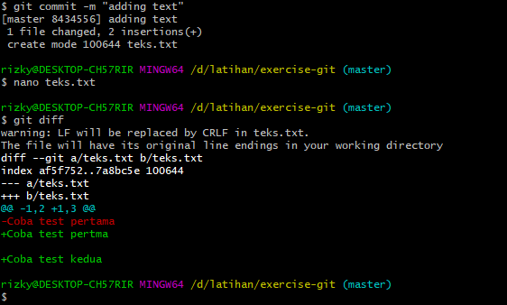

## 03 Branch and Merge

### Questions and Answer

<ol>
<li>
        What does git clean do ?
    </li>
    <p> Git Clone untum mengapus file yang tidak terlacak dari working tree</p>
    <p>Referensi : <a href="https://git-scm.com/docs/git-clean">https://git-scm.com/docs/git-clean </a></p>

<li>
        What do the -d and -f flags for git clean do?
    </li>
    <p> Mari kita coba terlebih dahulu mengenai Git Clean
    
    <br>
    Dapat dilihat hal yang dapat dilakukan oleh Git Clean ialah menghapus file yang tidak ada dalam katakanlah master nya yang sebelumnya tidak di kita add sebelumnya (Git add.)

    -d menghapus directori yang tidak ada di working tree atau blum di tracked sebelumnya (Git Add)

    -f menghapus secara paksa file yang tidak ada dalam working tree

</p>

<p>Referensi : <a href="https://git-scm.com/docs/git-clean">https://git-scm.com/docs/git-clean </a></p>

<li>
        What git command creates a branch?
    </li>
    <p>Git Branch membuat percabangan di Git

```
git branch nama-branch

```

</p>
<li>
    What is the difference between a fast-forward and recursive merge?
</li>
    <p>fast-forward memiliki history line yang lulus (rapi) dengan branch master, sedangkan recursive merge history line nye bercabang (terdiri dari beberapa garis) </p>
<li>
    What git command changes to another branch?
</li>
<p>
   untuk berpindah antar percabangan menggunakan
</p>

```
git checkout name-branch | hash

```

<li>
    How do you remove modified or deleted files from the working directory?
</li>
    <p>
untuk remove modified file dari working directory dapat menggunakan
   
```
git checkout
```

untuk delete file dari working directory dapat menggunakan

```
git clean
```

</p>

<li>
   What git command deletes a branch?
</li>
    <p>
    untuk menghapus percabangan dapat menggunakan

```

git branch -d name-branch

```

</p>
<li>
   What does the git diff command do?
</li>
    <p>
    memberitahu kita secara mendetail apa saja perubahan yang terjadi di antara dua titik referensi Git. <br>contohnya dapat dilihat pada gambar berikut <br>
    

</p>

<li>
   How do you remove files from the staging area?
</li>
    <p>
    Dapat menggunakan perintah sebagai berikut

    git reset

</p>

<li>
   How do merge conflicts happen?
</li>
    <p>
    Perubahan pada file yang sama, dimana dua branch ketika akan dilakukan merge terjadi conflicts dimana git tidak dapat memutuskan perubahan mana yang digunakan
</p>

</ol>
<br>
