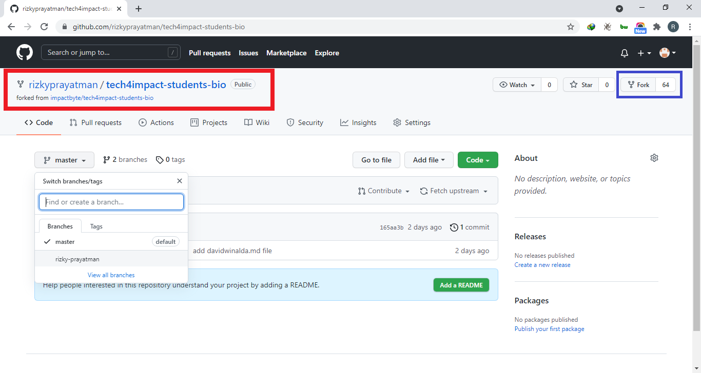
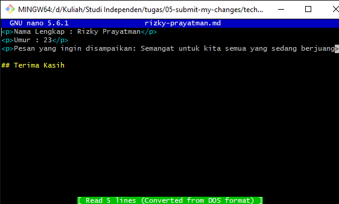

# 05 Submit my changes

## Berikut langkah-langkahnya

1. Langkah 1 Fork  
   

2. git clone https://github.com/impactbyte/tech4impact-students-bio.git

3. git branch rizky-prayatman

4. git checkout rizky-prayatman

5. touch rizky-prayatman.md

6. nano rizky-prayatman.md
   

7. git add .

8. git commit -m "rizky-prayatman.md"

9. git merge rizky-prayatman

10. git push origin -u rizky-prayatman

11. pull & request

