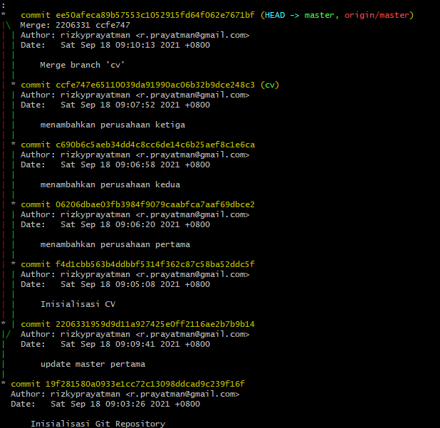
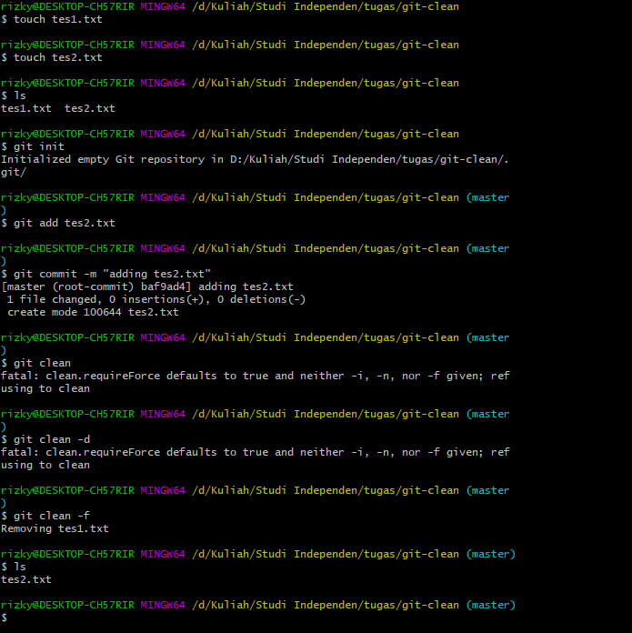
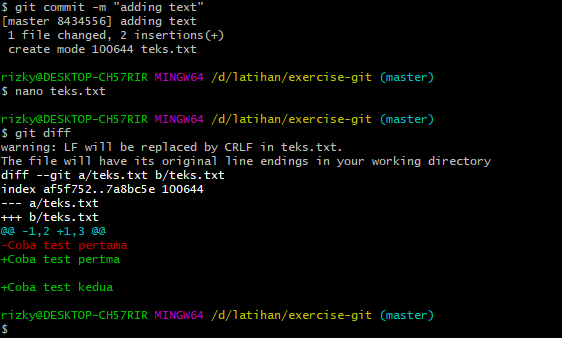
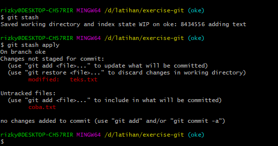
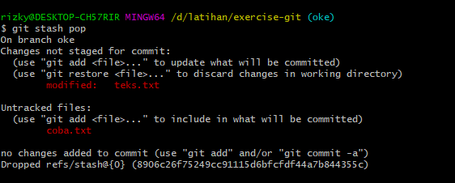

# 04 Git dan Github

## 01 The Basics

Link Repo : https://github.com/rizkyprayatman/git-basic

## 02 Portfolio dan CV

link Repo : https://github.com/rizkyprayatman/git-branch\

Screenshoot Terminal


<br>
<br>

## 03 Branch and Merge

### Questions and Answer

<ol>
<li>
        What does git clean do ?
    </li>
    <p> Git Clone untum mengapus file yang tidak terlacak dari working tree</p>
    <p>Referensi : <a href="https://git-scm.com/docs/git-clean">https://git-scm.com/docs/git-clean </a></p>

<li>
        What do the -d and -f flags for git clean do?
    </li>
    <p> Mari kita coba terlebih dahulu mengenai Git Clean
    
    <br>
    Dapat dilihat hal yang dapat dilakukan oleh Git Clean ialah menghapus file yang tidak ada dalam katakanlah master nya yang sebelumnya tidak di kita add sebelumnya (Git add.)

    -d menghapus directori yang tidak ada di working tree atau blum di tracked sebelumnya (Git Add)

    -f menghapus secara paksa file yang tidak ada dalam working tree

</p>

<p>Referensi : <a href="https://git-scm.com/docs/git-clean">https://git-scm.com/docs/git-clean </a></p>

<li>
        What git command creates a branch?
    </li>
    <p>Git Branch membuat percabangan di Git

```
git branch nama-branch

```

</p>
<li>
    What is the difference between a fast-forward and recursive merge?
</li>
    <p>Haloo</p>
<li>
    What git command changes to another branch?
</li>
<p>
   untuk berpindah antar percabangan menggunakan
</p>

```
git checkout name-branch | hash

```

<li>
    How do you remove modified or deleted files from the working directory?
</li>
    <p>
untuk menghapus file dari working directory dapat menggunakan
   
```
git rm

```
</p>

<li>
   What git command deletes a branch?
</li>
    <p>
    untuk menghapus percabangan dapat menggunakan

```

git branch -d name-branch

```
</p>
<li>
   What does the git diff command do?
</li>
    <p>
    memberitahu kita secara mendetail apa saja perubahan yang terjadi di antara dua titik referensi Git. <br>contohnya dapat dilihat pada gambar berikut <br>
    

</p>

<li>
   How do you remove files from the staging area?
</li>
    <p>
    Dapat menggunakan perintah sebagai berikut


    git restore --staged <individual_file>


</p>

<li>
   How do merge conflicts happen?
</li>
    <p>
    Perubahan file yang sama pada dua branch ketika akan dilakukan merge, terjadi conflicts dimana git tidak dapat memutuskan perubahan mana yang digunakan
</p>

</ol>
<br>
<br>

## 04 More Advanced

### Questions and Answer
<ol>
<li>
What is the difference between <b>git reset</b> and <b> git revert</b>. When would you use one over the other ?
</li>
<p>
Git reset berfungsi untuk mengatur ulang, dimana mengembalikan suatu kondisi berkas ke commit yang dituju dengan menghapus riwayat sesudahnya, sedangkan <br>
Git Revert berfungsi mengembalikan kondisi suatu berkas ke commit yang di tuju tanpa menghapus riwayat commit.
<br>
Pada saat menggunakan Git reset ataupun Git revert sebaiknya melihat kondisi yang diinginkan, jika ingin kembali ke commit yang dituju tanpa menyimpan riwayat sesudahnya gunakan Git reset namun jika tidak menginginkan demikian dapat menggunakan Git revert
</p>

<li>
What is the difference between <b> git merge</b> and <b>git rebase</b>. When would you use one over the other ?
</li>
<p>
Git Merge berkerja mengabungkan percabangan (branch) ke cabang utama menjadi satu <br>
Git Rebase berkerja merubah atau memodifikasi commit yang sudah ada dan dapat digunakan menggantikan merge. Perbedaannya ialah merge menghasilkam commit baru sedangkan rebase tidak.
<br>
Kapan penggunaannya yang tepat antara keduanya ? Penggunaan rebase digunakan saat masih dilokal guna merapikan percabangan (branch).
<br>
Referensi : https://git-scm.com/docs/git-rebase,
https://thesolidsnake.wordpress.com/2014/10/03/belajar-memakai-git-rebase/
</p>

<li>
What is the difference between <b>git stash pop</b> and <b> git stash apply </b>. When would you use one over the other ?
</li>
<p>
Git Stash memiliki kegunaan untuk menyimpan sementara dapat dilihat pada contoh di bawah <br>
 <br>
dapat di lihat bahwa git stash menyimpan sementara, dimana git stash apply mengembalikan hal telah disimpan sebelumnya namun masih tetap menyimpannya dalam penyimpanan, dan git stash pop dapat dilihat contohnya berikut
 <br>
sama hal nya dengan git stash apply namun yang membedakan git stash pop ialah untuk menerapkan simpanan dan menghapusnya dari daftar simpanan "Dropped refs/stash"
</p>

<li>
What kinds of things can you do in interactive mode when rebasing ?
</li>
<p>
User dapat re order commit dan opsi lainnya dalam commit, hal yang dapat dilakukan sebagai berikut : <br>
p, pick = menggunakan commit <br>
r, reword = edit commit <br>
e, edit = edit dan berhenti mengubah <br>
s, squash = edit dan menggabungkan commit sebelumnya <br>
f, fixup = sama dengan squash, namum menghapus log commit <br>
x, exec = menjalankan perintah lain menggunakan shell <br>
d, drop = menghapus commit <br>
</p> <br>
referensi : https://stackoverflow.com/questions/49626717/what-is-the-difference-between-interactive-rebase-and-normal-rebase

</ol>
<br>
<br>

## 05 Submit my changes

```
